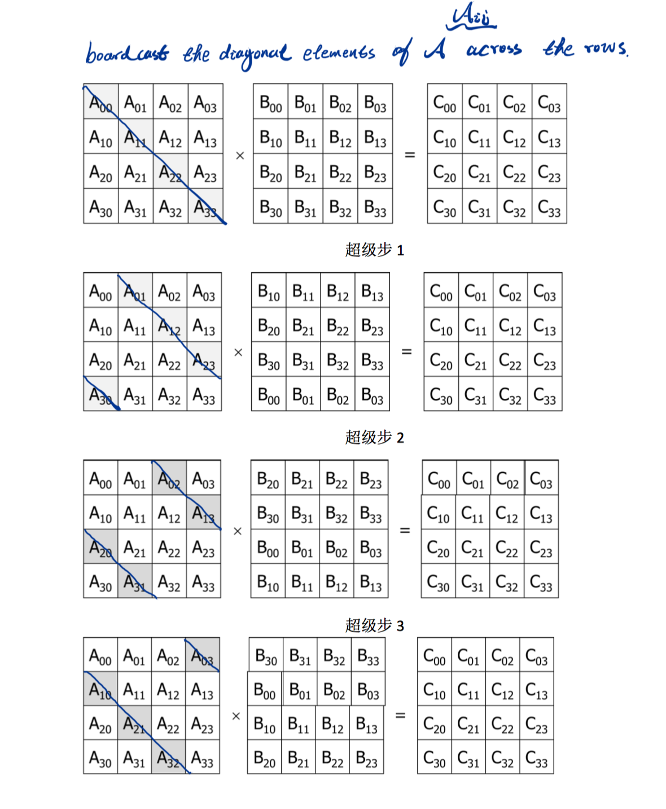

# **Parallel-Matrix-Multiplication-FOX-Algorithm**
:coffee:Implement of Parallel Matrix Multiplication Methods Using FOX Algorithm on *<span style="color: red">Peking University's High-performance Computing System</span>*

<center>

</center>
 
 Yes We Code
<center>

</center>

## Contents

1. **Reference Documents**
   * Thomas Anastasio, Example of Matrix Multiplication by Fox Method
   * Jaeyoung Choi, A New Parallel Matrix Multiplication Algorithm on Distributed-Memory Concurrent Computers
   * Ned Nedialkov, Communicators and Topologies: Matrix Multiplication Example
2. **Source Codes**
   * C language
   * Fortran
   * [Source Codes' Contents](http://github.com)
3. **Code Tests**
   * Dell XPS8900 
     * Code Test on Dell XPS8900 Workstation (Intel® Core™ i7-6700K Processor)
     * Analyzing MPI Performance Using Intel Trace Analyzer
   * PKU-HPC 
     * Lenovo X8800 Supercomputer Platform
     * Code Performance Tests on X8800 Supercomputer Platform's CPU Node (Intel® Xeon® Processor E5-2697A v4)
     * Code Performance Tests on X8800 Supercomputer Platform's MIC Node (Intel® Xeon Phi™ Processor 7250)
   * [Code Tests' Contents](http://github.com)
4. **Reports**
   * 1801111621_洪瑶_并行程序报告.pdf
   * 并行程序报告.docx
   * 洪瑶_1801111621并行程序设计报告.pptx
   * Parallel FOX Algorithm Project Report.pptx (will be added in the future)
   * Parallel FOX Algorithm Project Report Paper.tex (will be added in the future)
   * Parallel FOX Algorithm Project Report Paper.pdf (will be added in the future)
   * [Reports' Contents](https://github.com/yangyang14641/Parallel-Matrix-Multiplication-FOX-Algorithm/blob/master/Report/CONTENTS.md)
5. **Imagines**
   * FOX.png
   * FOX Stage Whole.JPG
   * FOX Stage Loading Balance.png

## **Brief Introduction to Parallel Matrix Multiplication FOX Algorithm**

### **Basic Concepts**

* 规约计算 (Reduction)
* 拥有者计算原则 (Owner Computing Rule)
* 流水并行(Pipeline Parallelism):
  * 在一个进程上，矩阵计算被划分为P个阶段 (P Supercomputing Steps in a Process)
* 数据并行 (Data Parallelism):
  * 在每个进程上同时计算局部的矩阵乘积 (Local Matrix Multiplications are computing on every processess at the same Computing Step)

### **Serial Matrix Multiplication**

* Mathematical Modeling of Matrix Multiplication
  * 

* Time Complexity
  * 

* Storage Complexity
  * 

* Example Implementation in C Language

``` c
for (i = 0; i < n; i++)                                      
        for (j = 0; j < n; j++)              
            for (k = 0; k < n; k++)
                C(i,j) = C(i,j) + A(i,k)*B(k,j);
```

### **Parallel Computing Modeling Design**

1. **Basic Flow**
* Matrix 's Dimension is , and Matirx 's Dimension is a .
* Compute Matrix  in parallel.
* Let  is the number of processors, and  be an integer such that it devides  and .
* Create a Cartesian topology with process mesh , and , .
* Denote , , .
* Distribute  and  by blocks on p processess such that  is  block and   is  block, stored on process .

2. **Details**

* Partitions of Matrices A, B and C. (Index syntax in Mathematical form: start from 1)
  * Matrix A
    * 

  * Matirx B
    * 

  * Matrix C
    * 

* Data Distribution on the 2-D Cartesian Topology Processes Mesh (Index syntax in Mathematical formulars: start from 1)
  * Data Mapping
    * |   Data Mesh   |    Mapping    | Process Mesh  |
      | ------------- |:-------------:|:-------------:|
      |       |  |               |
      |       |       |              |
      |  |       |               |

  * *<span style="color: red">Partition may not perfect such that every sub-matrix is a square matrix. Yet, that's not a problem, except load unbalance on each process!</span>*
  
  * Unbalanced Partition
    *  |        Item         |        Object      |
       |---------------------|--------------------|
       | Data Partition |  |
       | Data Partition |  |
       | Process Mesh |  |

  * Mathematical Modeling of Sub-Matirx Multiplication
    * 

### **Parallel Algorithm Design on BSP**
*<span style="color: violet">Parallelism type: Data parallelism with Pipeline parallelism</span>*

1. Rewrite the formula of Sub-Matirx Multiplication as q−1 Supercomputing Steps
   * | Stage | Mathematical Operation |
     |-------|------------------------|
     |   0   |  |
     |   1   |  |
     |   2   |  |
     |  ...  |        ...         |
     | q-2-i |  |
     | q-1-i |  |
     |  ...  |  |
     |  ...  |  |
     |  ...  |        ...         |
     |  q-1  |  |

   * *<span style="color: blue">Data parallelism: Local Matrix Multiplication operation in each processes for each supercomputing step.</span>*
  
2. Parallel Modeling Algorithm Operations on each step:
   * | Stage | Algorithm Operation |
     |-------|---------------------|
     |   0   | 1. Process   has ,   but needs  (for each index ) <br/> 2. Process  broadcast  across process mesh row  <br/> 3. Process  computes  |
     |   1   | 1.  has  and  but needs  and  <br/> 1.1 Shift the  block column of  by one block up (block  goes to block ) (period) <br/> 1.2  broadcast   across process mesh row  <br/> 2. Process  Compute  |
     |   2   | 1.  has   and   but needs   and  <br/> 1.1 Shift the  block column of  by one block up (block  goes to block ) (period) <br/> 1.2  broadcast   across process mesh row  <br/> 2. Process   Compute  |
     |  ...  |         ...         |
     | q-2-i |  |
     | q-1-i |  |
     |  ...  |  |
     |  ...  |  |
     |  ...  |         ...         |
     |  q-1  |  |

   * *<span style="color: blue">Pipe parallelism: The  Computing Steps for each process .</span>*
   * <center>  </center>

### **Algorithm Analysis**

   

1. **Algorithm Analysis on each Supercomputing Step**

   * | Stage | Algorithm Operation |Computing and  Communication Analysis|
     |-------|---------------------|---------------------|
     |   0   | 1. Process   has ,   but needs  (for each index ) <br/> 2. Process  broadcast  across process mesh row  <br/> 3. Process  computes  | Communication in Broadcast Operation: <br/>  <br/> Computing in each process: <br/>  <br/> Computing in total: <br/>  |
     |   1   | 1.  has  and  but needs  and  <br/> 1.1 Shift the  block column of  by one block up (block  goes to block ) (period) <br/> 1.2  broadcast   across process mesh row  <br/> 2. Process  Compute  | Communication in shift operation: <br/>  <br/> Communication in broadcast operation: <br/>  <br/> Communication in total: <br/>  <br/> Computing in each process: <br/>  <br/> Computing in total: <br/>  |
     |   2   | 1.  has   and   but needs   and  <br/> 1.1 Shift the  block column of  by one block up (block  goes to block ) (period) <br/> 1.2  broadcast   across process mesh row  <br/> 2. Process   Compute  | Communication in shift operation: <br/>  <br/> Communication in broadcast operation: <br/>  <br/> Communication in total: <br/>  <br/> Computing in each process: <br/>  <br/> Computing in total:<br/> |
     |  ...  |         ...         |  |
     | q-2-i |  |  |
     | q-1-i |  |  |
     |  ...  |  |  |
     |  ...  |  |  |
     |  ...  |         ...         |  |
     |  q-1  |  |  |

2. **Communication in total**
  * 

3. **Computing in total**
  * 

### **FOX Kernel in the Parallel MPI-C Program**

   * ``` c 
         n_bar = n/grid->q;
         Set_to_zero(local_C);

         source = (grid->my_row + 1) % grid->q;
         dest = (grid->my_row + grid->q - 1) % grid->q;

         temp_A = Local_matrix_allocate(n_bar);

         for (stage = 0; stage < grid->q; stage++) {
             bcast_root = (grid->my_row + stage) % grid->q;
             if (bcast_root == grid->my_col) {
               MPI_Bcast(local_A, 1, local_matrix_mpi_t,
                         bcast_root, grid->row_comm);
               Local_matrix_multiply(local_A, local_B,local_C);
             } else {
               MPI_Bcast(temp_A, 1, local_matrix_mpi_t,
                         bcast_root, grid->row_comm);
               Local_matrix_multiply(temp_A, local_B,local_C);
             }
             MPI_Sendrecv_replace(local_B, 1, local_matrix_mpi_t,
                                  dest, 0, source, 0, grid->col_comm, &status);
          }
     ```

## **Analysis**
  * <center>  </center>
  * <center>  </center>

## **Warranty** 
**Maybe, there are many mistakes in the both documents and Codes, because of the limitation of our knowledge and strength. As a result: THESE DOCUMENTS AND CODES ARE PROVIDED "AS IS" WITHOUT WARRANTY OF ANY KIND.
I MAKE NO WARRANTIES, EXPRESS OR IMPLIED, THAT THEY ARE FREE OF ERROR.**

## **Copyright**
**You can use and copy these works for any academic purpose, Except just copy to finish your homework or republish these works without proper declare their original author.**